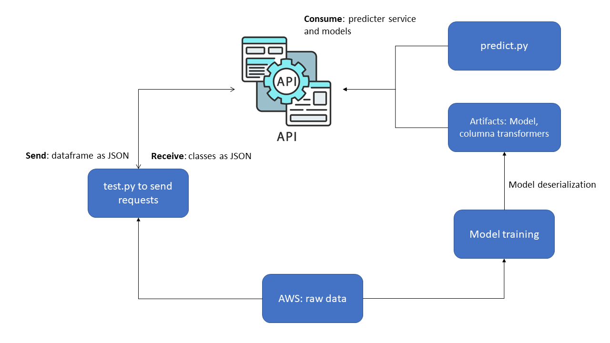

# properties-price-prediction

This is a project to predict properties price based on historical data

So here we will find how to implement supervised learning models and deploy them into production via API.

## Problem to solve:

We have a dataset with properties raw data. We want to use a classification algorithm to train a model that can make predictions on unseen data. In adittion, we want to deploy the model in order than can be accesed from other applications or systems anywhere via https (requests) om an API.

We will see that the metrics aren't the best ones, and to improve them we need more information or features.

### Steps to replicate this repo:

```sh
git clone <ssh code>
pip install pip --upgrade
virtualenv venv
source venv/bin/activate
pip install -r requirements.txt
```

## The simulated MLOps architechture:

